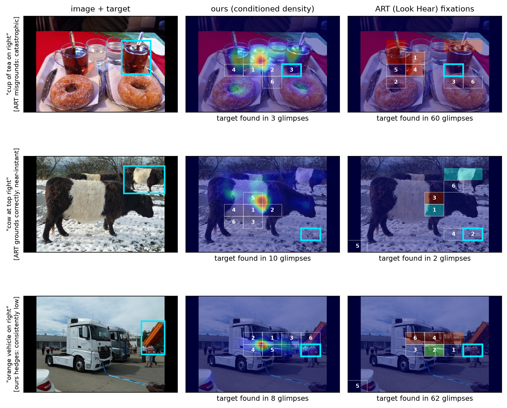

# Look First

Code and results for:

> Hamit Soyel. **Where to Look First: Language-Conditioned Attention Cuts the Expected and
> Worst-Case Cost of Visual Search.** IEEE Robotics and Automation Letters (submitted).

## The result in one paragraph

A robot told to fetch "the cup of tea on the right" must find that object in a
high-resolution frame before it can act. Inspecting the scene as a sequence of cropped
glimpses is cheap only if you know which crops to inspect first. **A 4.1M-parameter
text-conditioned readout on frozen features** (frozen DINOv2 + frozen CLIP text + a
FiLM-modulated ASPP head), trained on human gaze, orders glimpses so the referred object
is reached in a mean of **8.5 crops on an 8x8 grid, against 33.1 for raster scanning and
17.9 for the 751 MB scanpath model ART** ("Look Hear", ECCV 2024), while inspecting more
than half the frame on only **2% of searches against 24% for ART**. The correct referring
expression is what drives this: holding the model fixed, a mismatched expression costs
1.8 crops at 6x6 (p = 1.9e-23 over 391 image and expression pairs), a gap the standard
correlation metric barely registers (0.759 vs 0.720). The advantage over ART is
significant at the fine 8x8 grid (p = 0.003) but not at coarser ones, where ART's bimodal
profile still wins about 39% of individual stimuli; the tail gap above holds at every
grid. Because each avoided crop removes one call to an expensive grounding model, the
saving over ART grows with grounding cost, reaching ~50% at 100 ms per crop.



## Reproduction

1. **Get RefCOCO-Gaze** (not redistributed here): https://github.com/cvlab-stonybrook/refcoco-gaze
   Download the image stimuli and the train/val gaze JSONs, and build per-(image,
   expression) density maps under `data/refcoco_gaze/proc/` (images/, maps/,
   intents_{train,val}.json). The raw `refcocogaze_{train,val}.json` provide the target
   `BBOX` and per-observer `FIX_X/Y/DURATION` used to score search cost.
2. `pip install -r requirements.txt`
3. Train and evaluate:

```bash
python scripts/train_refcoco_gaze.py         # ~30 min on one GPU; conditioned readout
python scripts/eval_refcoco_grounding.py     # matched / mismatched / neutral controls
python scripts/compare_glimpse_baselines.py  # main table (all orderings, both grids)
python scripts/analyze_glimpse_distributions.py  # grid sweep + tail (Table II)
python scripts/robustness_checks.py          # grid-jitter + paraphrase robustness
python scripts/bench_latency.py              # planning latency + total search cost
python scripts/significance_tests.py         # paired Wilcoxon + Holm + bootstrap CIs
python scripts/eval_extended_split.py        # 391-pair evaluation (adds the held-out 299)
python scripts/make_fig_glimpse.py           # Fig. 1
```

Pre-computed result JSONs for every number in the paper are in `results/`.

## Baselines

The paper compares against three language-blind saliency models and one scanpath model,
each reduced to the same interface (a score per glimpse tile) so orderings differ only in
the score:

- `scripts/eval_sum_refcoco.py` runs **SUM** (WACV 2025, Mamba) and **DeepGaze IIE** on a
  CUDA GPU and dumps per-tile scores. It documents the dependency pins needed in 2026
  (mamba-ssm + causal-conv1d built against the container torch).
- `scripts/eval_art_refcoco.py` runs **ART** (the RefCOCO-Gaze authors' own "Look Hear"
  model) from its released checkpoint. **Coordinate-convention pitfall, verified from
  ART's own `inference.py`:** it emits `[min(w-1,int(x)), min(h-1,int(y))]`, i.e. `(x, y)`
  with x clamped by width, in 512x320 space, so no transpose is needed. Its 10 stochastic
  scanpaths per expression are pooled into tile counts, the same density-style aggregation
  used for the human oracle. ART is pinned to torch 1.12 / py3.8 / cu11.3 to match its
  authors' environment.

**Protocol note.** The ART comparison is on the 92-pair validation split (the largest with usable
target boxes; the test split was withdrawn by its authors pending an online benchmark). ART
used these stimuli for model selection, which favours it; we report it anyway. Every
other comparison additionally uses a 299-pair split held out from our training, for a
combined 391 pairs; ART is excluded there because it trained on the split those pairs
come from.

## Repository layout

```
src/model.py                          self-contained conditioned readout (IntentASPP)
scripts/train_refcoco_gaze.py         train + evaluate
scripts/eval_refcoco_grounding.py     matched/mismatched/neutral controls
scripts/compare_glimpse_baselines.py  main comparison table
scripts/analyze_glimpse_distributions.py  grid sweep + tail statistics
scripts/robustness_checks.py          grid-jitter + paraphrase robustness
scripts/significance_tests.py         paired Wilcoxon, Holm correction, bootstrap CIs
scripts/eval_extended_split.py        evaluation on 391 pairs (92 official + 299 held out)
scripts/bench_latency.py              latency and total-search-cost model
scripts/eval_sum_refcoco.py           SUM + DeepGaze IIE tile scores (GPU)
scripts/eval_art_refcoco.py           ART scanpaths (GPU, pinned env)
scripts/make_fig_glimpse.py           Fig. 1
results/                              pre-computed JSONs backing every number
figures/                             pre-rendered paper figure
```

## License / data

- Code: MIT (see `LICENSE`).
- **RefCOCO-Gaze images and gaze data are NOT redistributed**: obtain them from the
  authors' release and observe its terms. This repo contains only code, derived aggregate
  results, and the rendered figure.
- ART, SUM, and DeepGaze checkpoints come from their authors' own releases; used here for
  benchmarking.
